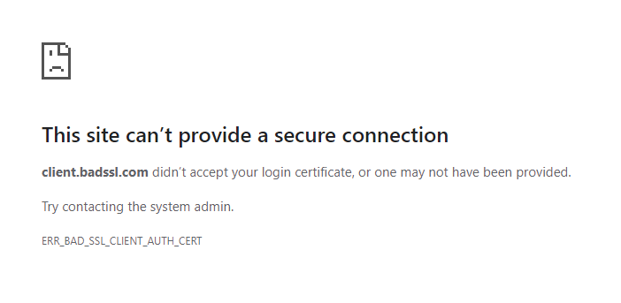

# TLS Authentication Firewall

This was a Proof-of-Concept how to do authentication on TLS connections based
on client certificated without requiring the middle proxy to terminate the
TLS session.

The idea is that since the session setup in TLS is in clear text, a front-end
proxy should be able to listen to the client certificate being sent and reject
the connection if that certificate is not authorized.

If the client certificate looks fine, the connection is allowed to continue
and will soon thereafter enter the encrypted state.

This allows the proxy in the middle to not have to break confidentiality of
the end-to-end.

## Why?

It seems like little work has been done into providing options to do
authentication close to the edge while still preserving secrecy of the
communication.

I wanted to prove to myself that my idea worked, and it does for TLSv1.2.
For TLSv1.3 this does not work.

## Usage

This PoC runs against the wonderful site badssl.com. Specifically, it uses
their https://client.badssl.com which requests a client certificate. The
certificates can be downloaded from https://badssl.com/download/.

Point client.badssl.com to localhost and run this PoC. You will see in the logs
that the proxy will be able to make authorization decisions based on the
certificate provided by your browser - while of course not being in possession
of the actual server certificate for badssl.com.

Example:

```
2020/06/10 13:20:15 Running...
2020/06/10 13:20:18 TLS 127.0.0.1:443 -> 127.0.0.1:58350, open
2020/06/10 13:20:18 TLS 127.0.0.1:443 -> 127.0.0.1:58350: handshake version=TLSv1.2, client=CN=BadSSL Client Certificate,O=BadSSL,L=San Francisco,ST=California,C=US
2020/06/10 13:20:18 TLS 127.0.0.1:443 -> 127.0.0.1:58350: not authorized, rejecting
```

Example if not authorized, as rendered by Chrome:




## What's up with "truly transparent"?

Apparently according to some folks there is already something called
"transparent TLS" which is anything but transparent, where the session is
terminated and re-initiated by the proxy.

The solution I present here is thus, comparatively, truly transparent.

## Issues?

 * TLSv1.3 encrypts everything from ServerHello, so for 1.3 and later this
   doesn't work.
 * The PoC only checks for the Certificate handshake record on the client side,
   not that the server is configured to authenticate it - so forcefully sending
   it would likely successfully set up the connection (even though it would break
   the RFC and strict servers should close the connection if that happens).
